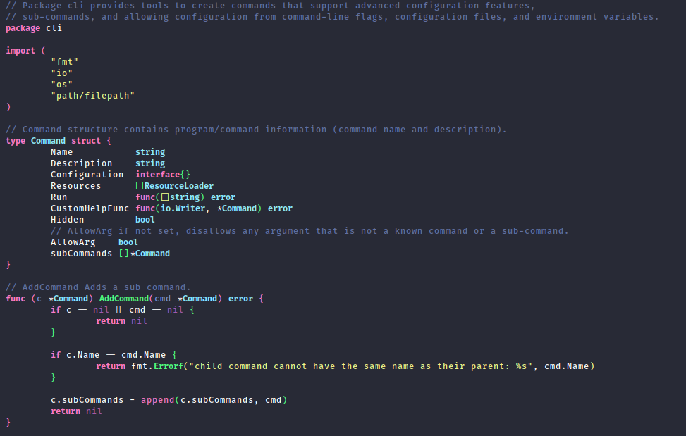

# Dracula for [Spacemacs](https://www.spacemacs.org/)

> A dark theme for [Spacemacs](https://www.spacemacs.org/)

## Install

All instructions can be found at [draculatheme.com/spacemacs](https://draculatheme.com/spacemacs).

## Team

This theme is maintained by the following person(s) and a bunch of [awesome contributors](https://github.com/dracula/spacemacs/graphs/contributors).

 |
--- |
[Guilherme Caruso](https://github.com/GuilhermeCaruso) |

## License

[MIT License](./LICENSE)